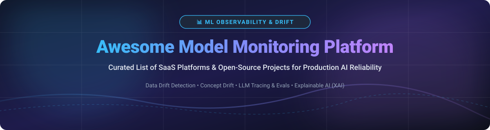

  
  
  
  
  
  

  

# 📊 Awesome Model Monitoring Platform

> **Curated List of Production ML Observability Tools, Data & Concept Drift Detectors, LLM Evaluation Frameworks & AI Governance Platforms.**

---

### 🔍 Overview & SEO Keywords
This repository tracks leading **SaaS platforms** and **open-source frameworks** designed for **ML Model Monitoring**, **AI Observability**, and **Generative AI Reliability**. Production Machine Learning models suffer from real-world silent failures—such as **covariate data drift**, **concept drift**, **feature degradation**, **out-of-distribution inputs**, and **LLM hallucinations**. 

Whether you are deploying tabular predictive models, computer vision systems, or complex RAG & LLM agents, this guide helps ML Engineers, MLOps Practitioners, and Data Science Leaders select the right observability stack.

---

## 📑 Table of Contents

- [📌 SaaS / Hosted Platforms](#-saas--hosted-platforms)
- [🛠️ Open-Source GitHub Projects](#%EF%B8%8F-open-source-github-projects)
- [📈 Star History](#-star-history)
- [🤝 How to Contribute](#-how-to-contribute)
- [☕ Support & Community](#-support--community)
- [⚠️ Disclaimer](#%EF%B8%8F-disclaimer)

---

## 📌 SaaS / Hosted Platforms

**📊 Market Size & Sector Dynamics**: The AI Model Monitoring & Observability market is estimated at **$3.31 Billion in 2026** (projected to reach $20.52 Billion by 2035 at a 22.5% CAGR). The sector is currently **highly fragmented**, featuring specialized point solutions alongside cloud infrastructure providers and traditional APM platforms.

| Platform | Description | Pricing (Starting Tier) | Free Tier / Trial Limit | Company Size / Valuation |
| :--- | :--- | :--- | :--- | :--- |
| 🚀 **[TruEra](https://truera.com/)** | Enterprise AI observability & LLM evaluation platform integrated into Snowflake AI Cloud. | $1,000 / month (Enterprise baseline prior to Snowflake acquisition) | 14-day free trial on cloud platform; TruLens open-source evaluation library free forever | **$60 Billion** (Acquired by Snowflake; $42.3M VC funding raised) |
| 🚀 **[Arize AI](https://arize.com/)** | ML & LLM observability platform for drift, evaluation, and root-cause tracing across model fleets. | $50 / month (AX Pro plan) | Free forever (AX Free: 25,000 trace spans/month, 1 GB storage, 15-day retention) | **$915 Million** (Acquired by Dynatrace; $131M VC funding raised) |
| 🚀 **[Fiddler AI](https://www.fiddler.ai/)** | AI observability and explainability platform combining drift detection, model monitoring & guardrails. | $0.002 / trace (Developer plan) | Free tier available (up to 1,000 traces/month trial access) | **$100 Million** total VC funding raised ($30M Series C in 2026) |
| 🚀 **[Galileo AI](https://rungalileo.io/)** | Evaluation, observability, and real-time guardrails platform for LLMs & Generative AI. | $100 / month (Pro plan billed annually, or $150/mo monthly) | Free forever (5,000 traces/month, unlimited users, unlimited custom evals) | **$68.1 Million** total VC funding raised ($45M Series B in Oct 2024) |
| 🚀 **[Arthur AI](https://www.arthur.ai/)** | Performance monitoring, explainability, and governance engine for enterprise AI models. | $60 / month (Premium plan) | Free plan ($0/mo: up to 4 use cases, 7-day data retention, unlimited seats) | **$60 Million** total VC funding raised ($42M Series B) |
| 🚀 **[WhyLabs](https://whylabs.ai/)** | Privacy-aware statistical profiling & data drift monitoring platform. | $125 / month (Historical Expert tier prior to Apple acquisition) | Free forever (Starter tier: 1 model & 5 feature profiles free; whylogs OSS free forever) | **$37 Million** valuation (Acquired by Apple; $14M VC funding raised) |
| 🚀 **[Aporia](https://www.aporia.com/)** | Model validation, monitoring, and live AI guardrail system for production ML pipelines. | $500 / month (Enterprise starter tier prior to Coralogix acquisition) | 14-day free trial (up to 10,000 predictions / 1 model on starter tier) | **$30 Million** total VC funding raised (Acquired by Coralogix; ~$8.4M ARR) |
| 🚀 **[Monitaur](https://monitaur.ai/)** | AI governance, risk management, and auditability platform for regulated enterprise sectors. | $2,000 / month (Custom enterprise baseline for regulated compliance) | 14-day guided proof-of-concept trial (no permanent self-service free tier) | **$13.2 Million** total VC funding raised ($6M Series A in May 2024) |
| 🚀 **[Superwise](https://www.superwise.ai/)** | Continuous model performance monitoring & runtime guardrail platform for ML agents. | $10 / month (Pro+ tier starter) | Free forever (Starter tier: 1 agent/dataset, basic guardrails & runtime policies) | **$4.5 Million** total VC funding raised (Acquired by Blattner Tech; ~$2.2M ARR) |
| 🚀 **[Evidently AI (Cloud)](https://www.evidentlyai.com/)** | Managed SaaS and self-hosted platform built on open-source Evidently ML evaluation framework. | $49 / month (Pro / Expert tier) | Free forever (1 user, up to 100 reports/month; core Python library 100% free open-source) | **~$1.5 Million** ARR / funding (Independent open-source framework leader) |

---

## 🛠️ Open-Source GitHub Projects

> *Sorted descending by GitHub Stars_Count.*

- 🌟 **[MLflow](https://github.com/mlflow/mlflow)**  — Comprehensive open-source platform for the machine learning lifecycle, including experiment tracking, model registry, and production model evaluation/monitoring.
- 🌟 **[Evidently](https://github.com/evidentlyai/evidently)**  — Leading open-source ML and LLM observability framework. Computes 100+ metrics for data drift, data quality, model performance, and generative AI evaluation with self-hosted dashboards.
- 🌟 **[Great Expectations](https://github.com/great-expectations/great_expectations)**  — Leading open-source data quality and validation framework to test, profile, and monitor data pipelines feeding production ML models.
- 🌟 **[Langfuse](https://github.com/langfuse/langfuse)**  — Open-source LLM engineering platform for tracing, evaluation, prompt management, and latency/cost metrics monitoring for generative AI applications.
- 🌟 **[Ragas](https://github.com/explodinggradients/ragas)**  — Open-source framework for evaluating Retrieval-Augmented Generation (RAG) pipelines and measuring context recall, faithfulness, and answer relevance.
- 🌟 **[Arize Phoenix](https://github.com/Arize-ai/phoenix)**  — Open-source AI observability visualization platform for tracing, evaluation, and fine-tuning LLMs, RAG applications, and autonomous agents.
- 🌟 **[Deepchecks](https://github.com/deepchecks/deepchecks)**  — Open-source suite for AI & ML validation and continuous production monitoring across tabular, NLP, and computer vision models.
- 🌟 **[TruLens](https://github.com/truera/trulens)**  — Open-source tool for evaluating and tracking LLM applications, RAG performance, and programmatically defining feedback functions.
- 🌟 **[Alibi Detect](https://github.com/SeldonIO/alibi-detect)**  — Open-source Python library for outlier, adversarial, and drift detection across tabular, text, and image datasets.
- 🌟 **[NannyML](https://github.com/NannyML/nannyml)**  — Open-source Python library specialized in estimating post-deployment model performance without ground truth (CBPE) and detecting multivariate drift.
- 🌟 **[whylogs](https://github.com/whylabs/whylogs)**  — Open-source lightweight profiling library for statistical sketches of datasets and ML input/output distributions without storing raw data.
- 🌟 **[OpenInference](https://github.com/Arize-ai/openinference)**  — Open standard telemetry specification built on OpenTelemetry for tracing and monitoring LLMs, prompts, guardrails, and AI agents.

---

## 📈 Star History

---

## 🤝 How to Contribute

Contributions are warmly welcomed! Help us keep this curated list up to date and comprehensive for the MLOps community.

1. 🍴 **Fork the Repository**
2. 🌿 **Create a Feature Branch** (`git checkout -b feature/add-new-tool`)
3. 📝 **Add or Edit Entries in `README.md`** (Please preserve alphabetical / star-count sorting order)
4. 💡 **Include**: Name, repository/website link, 1–2 sentence objective summary, pricing details, or Stars_Badge.
5. 🚀 **Submit a Pull Request** with a brief summary of the addition.

Check out [Awesome-Awesome-Awesome](https://github.com/ishandutta2007/Awesome-Awesome-Awesome) for more curated lists!

---

## ☕ Support & Community

Thank you for exploring **Awesome-Model-Monitoring-Platform**! If you find this curated list helpful for your MLOps workflow, production monitoring, or LLM evaluation stack:

- 🌟 **Star** this repository on GitHub to support visibility.
- 🔀 **Fork** and contribute new tools or updates.
- 📢 **Share** with your ML engineers, data scientists, and AI platform teams.
- ☕ **Sponsor / Buy me a coffee**: If you would like to support the maintenance of this repository, consider sponsoring via [GitHub Sponsors](https://github.com/sponsors/ishandutta2007).

  

---

## ⚠️ Disclaimer

- This list is **community-curated** for educational and architectural reference—it is non-exhaustive and does not constitute commercial endorsement.
- Model monitoring tools highlight statistical anomalies and drift, but do not replace clear human-in-the-loop governance, retraining pipelines, or alerting thresholds.
- Always review licensing, privacy compliance, and infrastructure overhead when deploying open-source or SaaS monitoring solutions in production environments.

---

  <b>Made with ❤️ for ML Engineers, MLOps Practitioners &amp; Data Scientists worldwide.</b>

